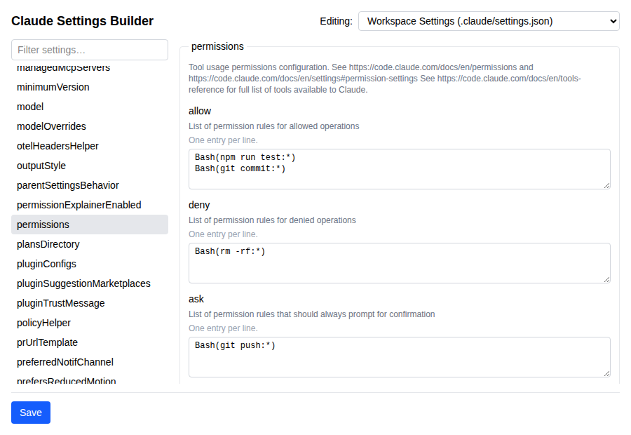
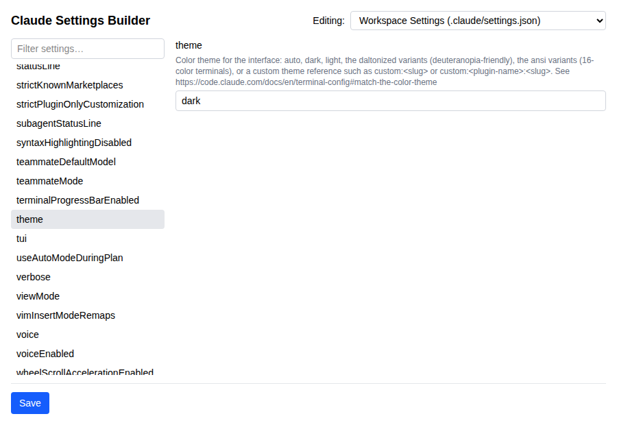

# Claude Settings Builder

[](https://marketplace.visualstudio.com/items?itemName=richardmcquiston01.claude-settings-builder)
[](https://marketplace.visualstudio.com/items?itemName=richardmcquiston01.claude-settings-builder)
[](https://marketplace.visualstudio.com/items?itemName=richardmcquiston01.claude-settings-builder)

## Overview

A VS Code extension that provides a GUI for building and editing Claude
Code's `.claude/settings.json` and `.claude/settings.local.json` files, and
the user-level `~/.claude/settings.json`, driven by Anthropic's published
JSON Schema — every documented setting is discoverable through form fields
instead of hand-written JSON.

## Features

- **Schema-driven form** — a filterable sidebar lists every top-level
  setting from the live [Claude Code settings
  schema](https://json.schemastore.org/claude-code-settings.json) (env
  vars, permissions, hooks, MCP server toggles, and more), each with its
  own description shown inline. Settings with a fixed set of presets plus
  room for a custom value (like `theme`) get autocomplete suggestions
  instead of a locked-down dropdown or raw JSON.
- **Three-target awareness** — an explicit picker always shows which file
  you're editing (workspace settings, workspace local settings, or user
  settings), and disables targets that aren't available (e.g. workspace
  targets when no folder is open) rather than silently offering them.
- **Non-destructive saves** — edits are merged into the existing file's
  JSON and validated against the schema before writing, so keys the
  schema doesn't know about survive and invalid JSON is never written.
- **Offline resilience** — if the live schema fetch fails, the extension
  falls back to a bundled copy and shows a warning that it may be stale.
  Use **Claude Settings Builder: Refresh Schema** to retry once you're
  back online.

## Getting Started

### Prerequisites

- [Node.js](https://nodejs.org/) `^22.22.2`, `^24.15.0`, or `>=26.0.0` (pinned
  by `webview-ui`'s `jsdom` test dependency — an older Node triggers an
  `EBADENGINE` warning at install time) and npm
- Visual Studio Code

### Installation

```sh
npm install
```

Installs both the extension host dependencies and the `webview-ui`
dependencies.

### Usage

```sh
npm run build   # build the extension host and the webview bundle
npm run watch   # rebuild both on change
npm run lint    # lint the extension host and the webview-ui app
npm test        # run the extension host and webview-ui test suites
```

Press `F5` in VS Code to launch the Extension Development Host, then run
one of the commands below from the Command Palette (`Cmd/Ctrl+Shift+P`).

### Commands

| Command | Description |
| --- | --- |
| `Claude Settings Builder: Open` | Opens the settings editor panel. |
| `Claude Settings Builder: Refresh Schema` | Retries the live schema fetch for the currently open panel — useful after starting a session offline. |

### Packaging

```sh
npm run package
```

Produces a `claude-settings-builder-<version>.vsix` file you can install
locally via VS Code's **Extensions: Install from VSIX...** command, or
`code --install-extension claude-settings-builder-<version>.vsix`.

## Screenshots

The schema-driven form, showing `permissions`' nested `allow`/`deny`/`ask`
rule lists alongside the three-target picker:



The `theme` field — an enum of presets plus room for a custom value —
rendered as a real text input with autocomplete suggestions instead of
falling back to raw JSON:



## License

Apache 2

## Copyright

(c)2026 Richard McQuiston. All rights reserved.

## Buy Me a Coffee

If this app, code, or repository has helped you or someone you know, please consider donating. I appreciate any help to offset the costs of development and/or AI Credits.

[**Donate via Stripe**](https://donate.stripe.com/00w5kD3Gj1Xo9v7gVOcs800), or scan:

[](https://donate.stripe.com/00w5kD3Gj1Xo9v7gVOcs800)
